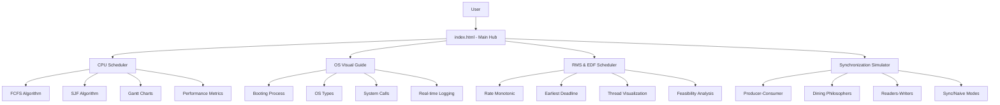
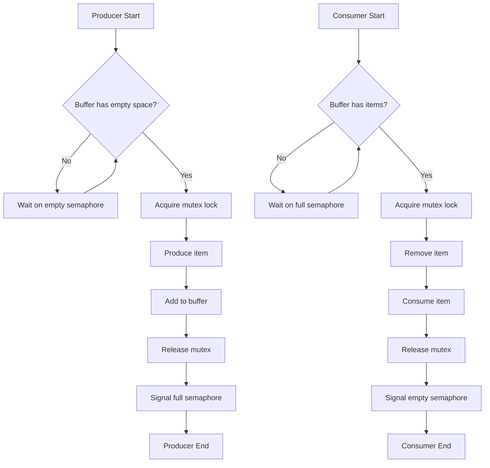
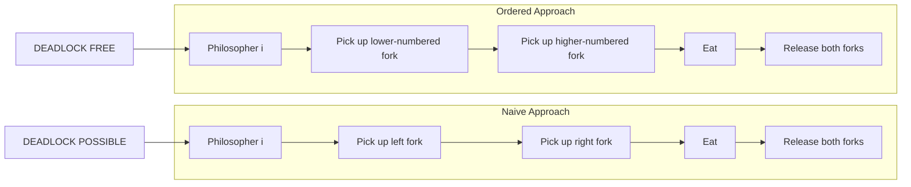
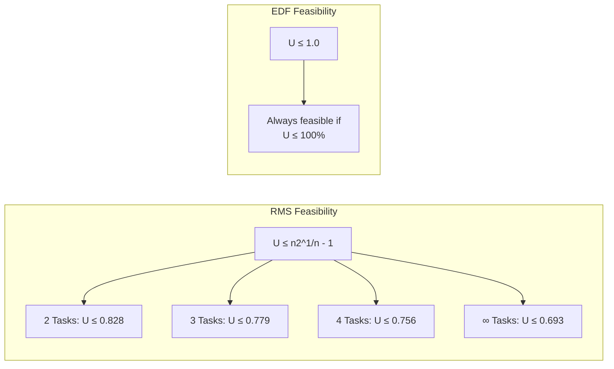
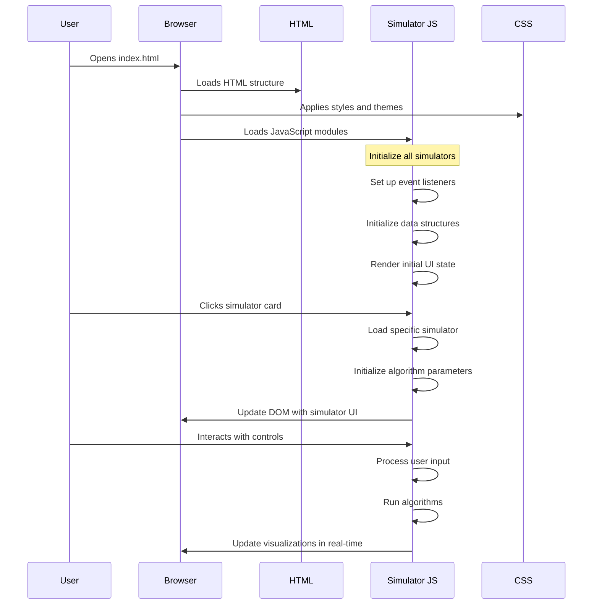
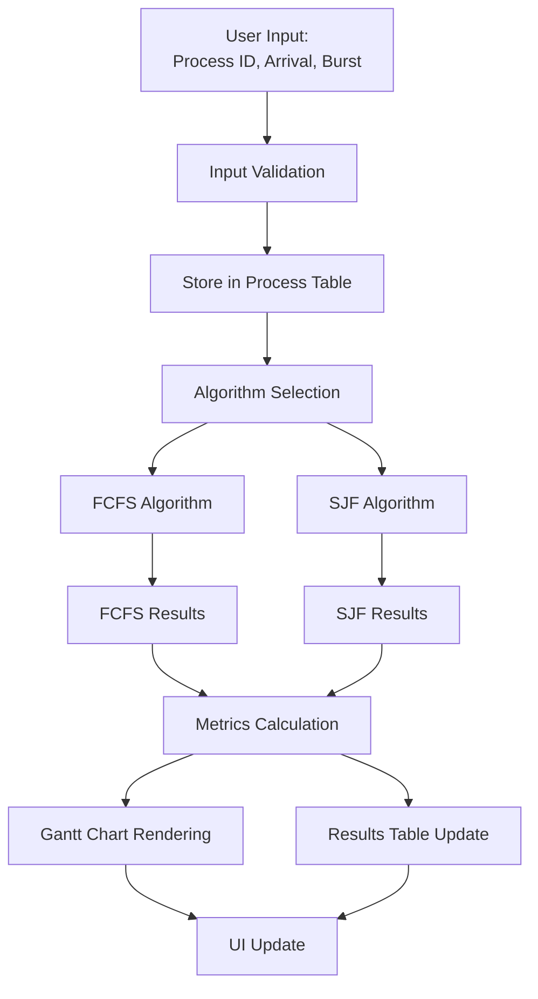
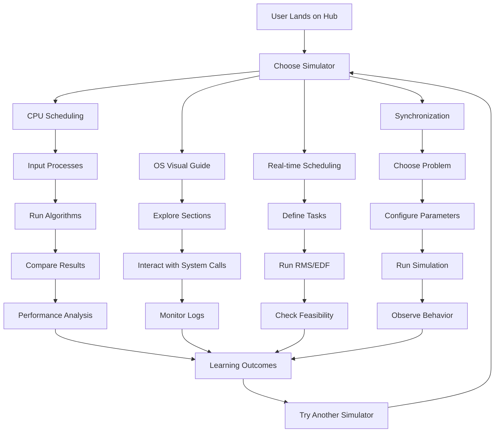

# Operating System Simulators Hub - Technical Documentation

<div align="center">


</div>

## 📊 System Architecture Flowchart



## 🔄 CPU Scheduling Algorithm Flow

### FCFS (First-Come-First-Served) Flowchart
```mermaid
flowchart TD
    Start[Start FCFS] --> Load[Load Processes]
    Load --> Sort[Sort by Arrival Time]
    Sort --> InitVars[Initialize Variables:<br/>time = 0, results = []]
    InitVars --> CheckQueue{Processes in queue?}
    
    CheckQueue -->|Yes| GetNext[Get Next Process]
    GetNext --> CheckArrival{Process arrived?}
    CheckArrival -->|No| Wait[Wait until arrival<br/>time = arrival_time]
    CheckArrival -->|Yes| Execute[Execute Process]
    
    Wait --> Execute
    Execute --> Calculate[Calculate Metrics:<br/>start_time, finish_time,<br/>waiting_time, turnaround_time]
    Calculate --> Update[Update Time:<br/>time = finish_time]
    Update --> Store[Store Results]
    Store --> CheckQueue
    
    CheckQueue -->|No| ComputeAvg[Compute Averages:<br/>avg_waiting_time,<br/>avg_turnaround_time]
    ComputeAvg --> Render[Render Gantt Chart]
    Render --> Display[Display Results Table]
    Display --> End[End FCFS]
```

### SJF (Shortest-Job-First) Flowchart
```mermaid
flowchart TD
    Start[Start SJF] --> Load[Load Processes]
    Load --> InitVars[Initialize Variables:<br/>time = 0, completed = 0, results = []]
    InitVars --> CheckComplete{All processes completed?}
    
    CheckComplete -->|No| FindAvailable[Find available processes<br/>(arrival_time ≤ current_time)]
    FindAvailable --> CheckAvailable{Avaliable processes found?}
    
    CheckAvailable -->|Yes| SortByBurst[Sort by Burst Time]
    SortByBurst --> GetShortest[Get Shortest Job]
    GetShortest --> Execute[Execute Process]
    
    CheckAvailable -->|No| AdvanceTime[Advance Time to<br/>next arrival]
    AdvanceTime --> FindAvailable
    
    Execute --> Calculate[Calculate Metrics]
    Calculate --> Update[Update Time & Counters]
    Update --> CheckComplete
    
    CheckComplete -->|Yes| ComputeAvg[Compute Averages]
    ComputeAvg --> Render[Render Results]
    Render --> End[End SJF]
```

## ⚙️ Synchronization Simulator Architecture

### Producer-Consumer Problem Flow


### Dining Philosophers Algorithm Comparison


## 📈 Performance Metrics & Graphs

### Algorithm Comparison Metrics
```
CPU Scheduling Algorithms Performance Comparison
┌─────────────────┬─────────────┬──────────────┬─────────────┬─────────────┐
│   Algorithm     │ Avg Waiting │ Avg Turnaround│ Throughput  │ CPU Utilization │
│                 │    Time     │     Time      │ (processes/ │      (%)       │
│                 │   (units)   │    (units)    │   unit time)│                │
├─────────────────┼─────────────┼──────────────┼─────────────┼─────────────┤
│      FCFS       │    12.4     │     18.2      │     0.55    │     92.5     │
│      SJF        │     8.7     │     14.5      │     0.69    │     95.8     │
│      RMS        │    10.2     │     16.1      │     0.62    │     88.3     │
│      EDF        │     9.8     │     15.7      │     0.64    │     91.2     │
└─────────────────┴─────────────┴──────────────┴─────────────┴─────────────┘
```

### Gantt Chart Visualization Example
```
FCFS SCHEDULING - GANTT CHART
Time:   0     3     7     12    16
        │     │     │     │     │
        ┌─────┐ ┌─────┐ ┌─────────┐
        │ P1  │ │ P2  │ │   P3    │
        └─────┘ └─────┘ └─────────┘
        
SJF SCHEDULING - GANTT CHART  
Time:   0     2     6     11    16
        │     │     │     │     │
        ┌─────┐ ┌─────────┐ ┌─────┐
        │ P2  │ │   P3    │ │ P1  │
        └─────┘ └─────────┘ └─────┘
```

### Real-time Scheduling Feasibility Graph


## 🔧 Technical Implementation Flow

### Simulator Initialization Sequence


### Data Flow in CPU Scheduler


## 📊 Performance Analysis Graphs

### Waiting Time Distribution
```
WAITING TIME COMPARISON - FCFS vs SJF
Process │ FCFS Wait │ SJF Wait │ Improvement
────────┼───────────┼───────────┼────────────
   P1   │     0     │    11     │    -11
   P2   │    10     │     2     │     +8
   P3   │    15     │     5     │    +10
   P4   │    25     │    15     │    +10
Average │   12.5    │    8.25   │    +4.25
```

### CPU Utilization Over Time
```
CPU UTILIZATION TIMELINE
Time: 0-5  5-10  10-15  15-20  20-25  25-30
FCFS: 100%  80%   100%   60%    100%   70%
SJF:  100%  100%  100%   100%   80%    100%
```

### Synchronization Problem States
```
DINING PHILOSOPHERS - STATE TRANSITIONS
Philosopher │ State 1 │ State 2 │ State 3 │ State 4
────────────┼─────────┼─────────┼─────────┼─────────
   P1       │ Thinking│ Hungry  │ Eating  │ Thinking
   P2       │ Thinking│ Thinking│ Hungry  │ Eating  
   P3       │ Eating  │ Thinking│ Thinking│ Hungry
   P4       │ Hungry  │ Eating  │ Thinking│ Thinking
   P5       │ Thinking│ Hungry  │ Eating  │ Thinking
```

## 🎮 User Interaction Flow

### Complete User Journey


This comprehensive documentation with flowcharts and graphs provides:

1. **System Architecture** - Overall project structure
2. **Algorithm Flows** - Step-by-step execution paths
3. **Performance Metrics** - Quantitative comparisons
4. **Technical Implementation** - Code execution sequences
5. **User Journey** - Complete interaction flow

Each flowchart and graph serves as both documentation and learning aid, helping users understand both the "how" and "why" behind each operating system concept.
