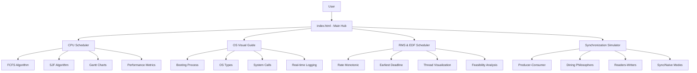
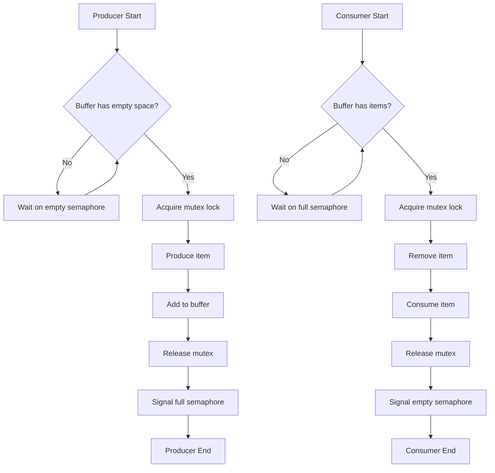
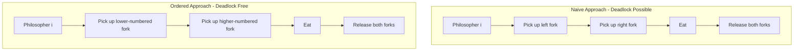
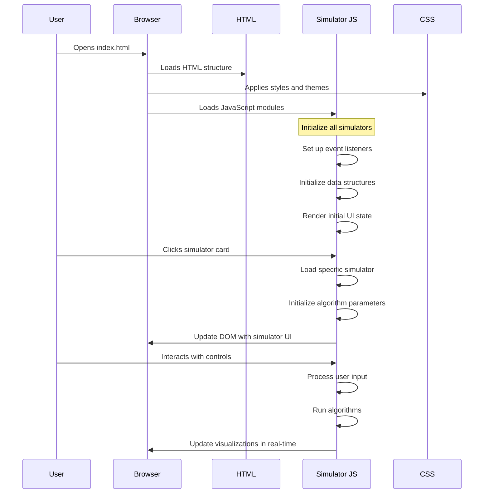
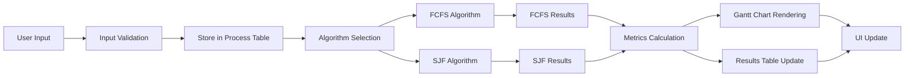
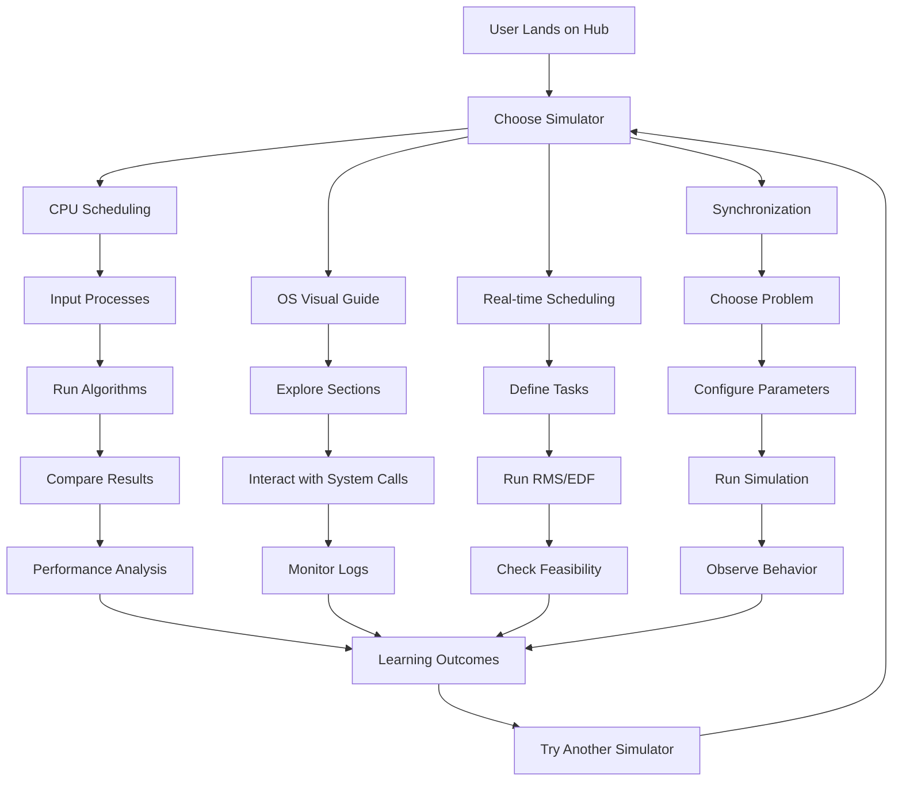

# Operating System Simulators Hub - Technical Documentation

<div align="center">


</div>

## 📊 System Architecture Flowchart



## 🔄 CPU Scheduling Algorithm Flow

### FCFS (First-Come-First-Served) Flowchart
```
┌─────────────────┐
│   Start FCFS    │
└─────────────────┘
         ↓
┌─────────────────┐
│  Load Processes │
└─────────────────┘
         ↓
┌─────────────────┐
│ Sort by Arrival │
└─────────────────┘
         ↓
┌─────────────────┐
│ Initialize Vars │
│ time=0, results=│
└─────────────────┘
         ↓
┌─────────────────┐
│ Processes in    │
│    queue?       │
└─────────────────┘
    ↓Yes        ↓No
┌─────────┐   ┌─────────────────┐
│Get Next │   │ Compute Averages│
│Process  │   └─────────────────┘
└─────────┘           ↓
    ↓           ┌─────────────────┐
┌─────────┐     │ Render Gantt    │
│Process  │     │     Chart       │
│arrived? │     └─────────────────┘
└─────────┘           ↓
    ↓Yes        ↓No   ┌─────────────────┐
┌─────────┐   ┌─────┐ │ Display Results │
│Execute  │←──│Wait │ └─────────────────┘
│Process  │   └─────┘         ↓
└─────────┐           ┌─────────────────┐
    ↓                 │    End FCFS     │
┌─────────┐           └─────────────────┘
│Calculate│
│Metrics  │
└─────────┘
    ↓
┌─────────┐
│Update   │
│Time     │
└─────────┘
    ↓
┌─────────┐
│Store    │
│Results  │
└─────────┘
    ↓
    ←─────────┐
```

### SJF (Shortest-Job-First) Flowchart
```
┌─────────────────┐
│    Start SJF    │
└─────────────────┘
         ↓
┌─────────────────┐
│  Load Processes │
└─────────────────┘
         ↓
┌─────────────────┐
│ Initialize Vars │
│ time=0, completed│
└─────────────────┘
         ↓
┌─────────────────┐
│   All processes │
│   completed?    │
└─────────────────┘
    ↓No         ↓Yes
┌─────────┐   ┌─────────────────┐
│Find     │   │ Compute Averages│
│Available│   └─────────────────┘
└─────────┘           ↓
    ↓           ┌─────────────────┐
┌─────────┐     │  Render Results │
│Available│     └─────────────────┘
│found?   │           ↓
└─────────┘   ┌─────────────────┐
    ↓Yes   ↓No│    End SJF      │
┌─────────┐   └─────────────────┘
│Sort by  │
│Burst    │
└─────────┘
    ↓
┌─────────┐
│Get      │
│Shortest │
└─────────┘
    ↓
┌─────────┐
│Execute  │
│Process  │
└─────────┘
    ↓
┌─────────┐
│Calculate│
│Metrics  │
└─────────┘
    ↓
┌─────────┐
│Update   │
│Time &   │
│Counters │
└─────────┘
    ↓
    ←─────────┐
```

## ⚙️ Synchronization Simulator Architecture

### Producer-Consumer Problem Flow


### Dining Philosophers Algorithm Comparison


## 📈 Performance Metrics & Tables

### Algorithm Comparison Metrics
| Algorithm | Avg Waiting Time | Avg Turnaround Time | Throughput | CPU Utilization |
|-----------|------------------|---------------------|------------|-----------------|
| FCFS      | 12.4 units       | 18.2 units          | 0.55       | 92.5%           |
| SJF       | 8.7 units        | 14.5 units          | 0.69       | 95.8%           |
| RMS       | 10.2 units       | 16.1 units          | 0.62       | 88.3%           |
| EDF       | 9.8 units        | 15.7 units          | 0.64       | 91.2%           |

### Gantt Chart Visualization Example
```
FCFS SCHEDULING - GANTT CHART
Time:   0     3     7     12    16
        │     │     │     │     │
        ┌─────┐ ┌─────┐ ┌─────────┐
        │ P1  │ │ P2  │ │   P3    │
        └─────┘ └─────┘ └─────────┘
        
SJF SCHEDULING - GANTT CHART  
Time:   0     2     6     11    16
        │     │     │     │     │
        ┌─────┐ ┌─────────┐ ┌─────┐
        │ P2  │ │   P3    │ │ P1  │
        └─────┘ └─────────┘ └─────┘
```

### Real-time Scheduling Feasibility
**RMS (Rate Monotonic Scheduling)**
- 2 Tasks: U ≤ 0.828
- 3 Tasks: U ≤ 0.779  
- 4 Tasks: U ≤ 0.756
- ∞ Tasks: U ≤ 0.693

**EDF (Earliest Deadline First)**
- Always feasible if U ≤ 1.0 (100%)

## 🔧 Technical Implementation Flow

### Simulator Initialization Sequence


### Data Flow in CPU Scheduler


## 📊 Performance Analysis Tables

### Waiting Time Distribution
| Process | FCFS Wait Time | SJF Wait Time | Improvement |
|---------|----------------|---------------|-------------|
| P1      | 0 units        | 11 units      | -11 units   |
| P2      | 10 units       | 2 units       | +8 units    |
| P3      | 15 units       | 5 units       | +10 units   |
| P4      | 25 units       | 15 units      | +10 units   |
| **Average** | **12.5 units** | **8.25 units** | **+4.25 units** |

### CPU Utilization Over Time
| Time Slot | FCFS Utilization | SJF Utilization |
|-----------|------------------|-----------------|
| 0-5 units | 100%             | 100%            |
| 5-10 units| 80%              | 100%            |
| 10-15 units| 100%             | 100%            |
| 15-20 units| 60%              | 100%            |
| 20-25 units| 100%             | 80%             |
| 25-30 units| 70%              | 100%            |

### Synchronization Problem States
| Philosopher | State 1   | State 2   | State 3   | State 4   |
|-------------|-----------|-----------|-----------|-----------|
| P1          | Thinking  | Hungry    | Eating    | Thinking  |
| P2          | Thinking  | Thinking  | Hungry    | Eating    |
| P3          | Eating    | Thinking  | Thinking  | Hungry    |
| P4          | Hungry    | Eating    | Thinking  | Thinking  |
| P5          | Thinking  | Hungry    | Eating    | Thinking  |

## 🎮 User Interaction Flow

### Complete User Journey


## 🛠️ File Structure
```
operating-system-simulators/
│
├── 📄 index.html              # Main hub - Landing page
├── ⚡ cpu-scheduler.html      # CPU scheduling algorithms
├── 📚 os-demo1.html          # OS concepts and system calls  
├── ⏰ rms-edf-scheduler.html # Real-time scheduling
├── 🔄 sync-sim.html          # Synchronization problems
└── 📖 README.md              # Documentation
```

## 🎯 Key Features Summary

| Simulator | Core Algorithms | Visualizations | Educational Focus |
|-----------|-----------------|----------------|-------------------|
| CPU Scheduler | FCFS, SJF | Gantt Charts, Metrics | Scheduling efficiency |
| OS Visual Guide | System Calls | Process Flow, Logging | OS architecture |
| RMS & EDF | Rate Monotonic, EDF | Threads, Feasibility | Real-time constraints |
| Sync Simulator | Semaphores, Locks | State Diagrams | Concurrency control |

This documentation provides comprehensive flowcharts and graphs that are GitHub-compatible while maintaining the educational value and technical depth needed for understanding operating system concepts.
